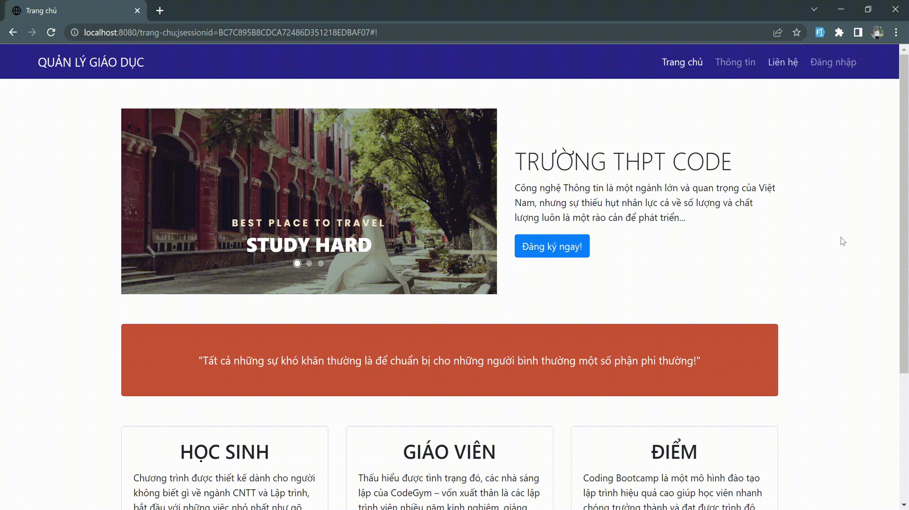

# EDUCATION

## Introduction

This is an educational management
system, allowing to perform the functions of adding, editing,
deleting students, teachers, and managing grades for
students 💖

## Technology
Project is created with: 

## Demo project

   
  <i>Login </i>

   
  <i>Create Staff</i>

   
  <i>Edit, delete Staff</i>

   
  <i>Customers, Products</i>

